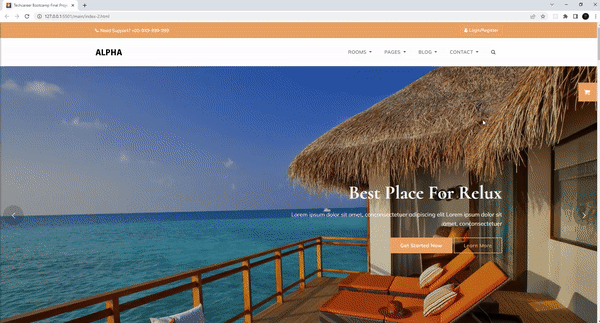
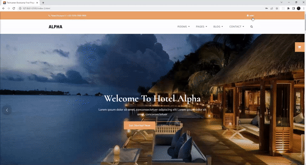
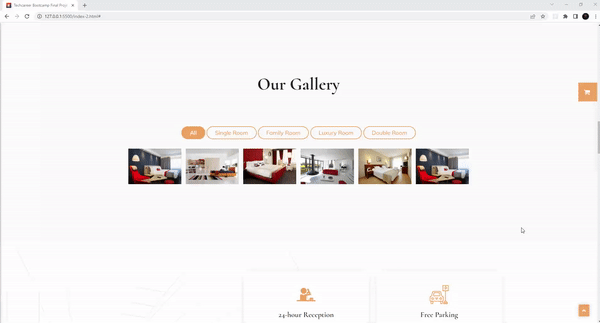
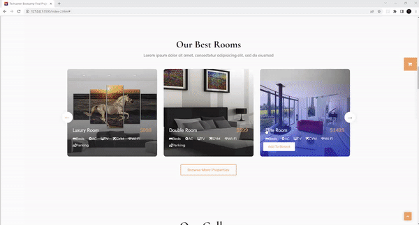
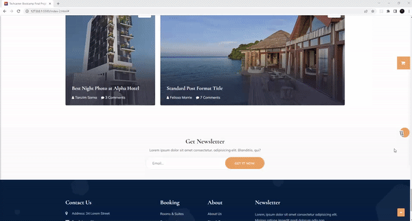
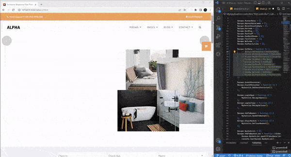

# Hotel Reservation Website with AngularJS
### Techcareer Front-End Web Development Bootcamp

#### Technologies
1. AngularJS
1. JavaScript
1. HTML
1. CSS
1. Bootstrap

#### Features

1. [Login-Register](#login-register)
1. [User Panel](#user-panel)
1. [Gallery Panel](#gallery-panel)
1. [Shopping Basket](#shopping-basket)
1. [Discount Coupon](#discount-coupon)
1. [Data's Used with AngularJS](#datas-used-with-angularjs)

---

### Login-Register

### User Panel

### Gallery Panel

### Shopping Basket

### Discount Coupon

### Data's Used with AngularJS

Data's using with AngularJS from data folders
 

